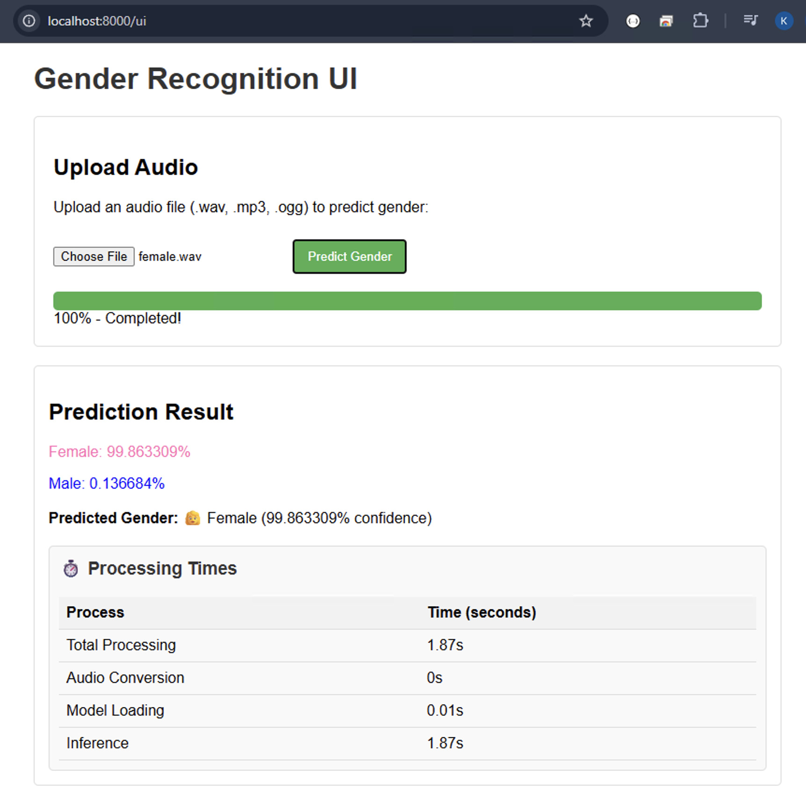

# 🎙️ Voice Gender Detection API

A high-performance REST API for real-time gender recognition from audio files using state-of-the-art wav2vec2 deep learning models. Features a modern web interface and comprehensive API documentation.



## ✨ Features

- **🎯 Accurate Predictions**: Advanced wav2vec2 model with 99.93% F1 score
- **🚀 Fast Processing**: Optimized inference pipeline with detailed performance metrics
- **🌐 REST API**: FastAPI backend with automatic OpenAPI documentation
- **💻 Web Interface**: Clean, responsive UI for easy testing and interaction
- **🐳 Docker Ready**: Pre-built images with models included for instant deployment
- **📊 Rich Logging**: Comprehensive logging with performance insights
- **🔧 Multiple Formats**: Supports WAV, MP3, and OGG audio files

## 🚀 Quick Start

### Using Docker (Recommended)

Run the service instantly with pre-loaded models:

```bash
docker run -p 8000:8000 mashreghi/voice-gender-detection:latest
```

Then open your browser to:
- **Web Interface**: http://localhost:8000/ui
- **API Documentation**: http://localhost:8000/docs

### Docker Compose

Create `docker-compose.yml`:

```yaml
version: '3.8'
services:
  voice-gender-api:
    image: mashreghi/voice-gender-detection:latest
    container_name: voice-gender-api
    ports:
      - "8000:8000"
    restart: unless-stopped
    environment:
      - PYTHONUNBUFFERED=1
```

Start the service:
```bash
docker-compose up -d
```

## 📋 API Reference

### Endpoints

| Method | Endpoint | Description |
|--------|----------|-------------|
| `GET` | `/` | Welcome page with navigation links |
| `GET` | `/ui` | Interactive web interface |
| `GET` | `/docs` | OpenAPI documentation |
| `POST` | `/predict` | Gender prediction from audio file |

### Prediction API

**Endpoint**: `POST /predict`

**Request**:
- **Content-Type**: `multipart/form-data`
- **Body**: Audio file (WAV, MP3, OGG)
- **Max Duration**: 5 seconds recommended

**Response**:
```json
{
  "female": 0.998633,
  "male": 0.001367,
  "prediction": "female",
  "confidence": 0.998633,
  "processing_time_ms": 245
}
```

## 💡 Usage Examples

### cURL
```bash
curl -X POST "http://localhost:8000/predict" \
  -H "accept: application/json" \
  -H "Content-Type: multipart/form-data" \
  -F "file=@sample.wav"
```

### Python
```python
import requests

# Make prediction
url = "http://localhost:8000/predict"
with open("sample.wav", "rb") as audio_file:
    files = {"file": audio_file}
    response = requests.post(url, files=files)

result = response.json()
print(f"Prediction: {result['prediction']}")
print(f"Confidence: {result['confidence']:.2%}")
```

### JavaScript
```javascript
const formData = new FormData();
formData.append('file', audioFile);

fetch('http://localhost:8000/predict', {
  method: 'POST',
  body: formData
})
.then(response => response.json())
.then(data => {
  console.log(`Gender: ${data.prediction}`);
  console.log(`Confidence: ${(data.confidence * 100).toFixed(1)}%`);
});
```

## 🛠️ Local Development

For optimal performance or development work:

### Prerequisites
- Python 3.9+
- pip

### Setup
```bash
# Clone repository
git clone https://github.com/mashreghi/voice-gender-detection.git
cd voice-gender-detection

# Create virtual environment
python -m venv venv
source venv/bin/activate  # On Windows: venv\Scripts\activate

# Install dependencies
pip install numpy==1.24.3
pip install -r requirements.txt

# Start server
python main.py
```

The API will be available at http://localhost:8000

## 🧠 Model Information

This service uses the **wav2vec2-large-xlsr-53-gender-recognition-librispeech** model:

### Technical Specifications
- **Base Model**: Facebook's wav2vec2-xls-r-300m
- **Training Dataset**: LibriSpeech-clean-100
- **Performance**: F1 score of 0.9993, loss of 0.0061
- **Audio Requirements**: 16kHz mono, up to 5 seconds
- **Languages**: Optimized for English, works with other languages

### Model Performance
- **Accuracy**: 99.93% on test set
- **Speed**: ~200-500ms inference time
- **Memory**: ~2GB RAM recommended

## ⚠️ Ethical Considerations & Limitations

### Important Disclaimers
- **Educational Purpose**: This tool is designed for research and educational use
- **Binary Classification**: Only distinguishes between male/female acoustic patterns
- **Dataset Bias**: Trained on LibriSpeech which may not represent all voice diversity
- **Probabilistic**: Results are confidence scores, not definitive gender identity

### Responsible Usage Guidelines
- ✅ **DO**: Use for research, accessibility tools, content moderation
- ✅ **DO**: Obtain proper consent before processing voice data
- ✅ **DO**: Consider cultural and linguistic diversity limitations
- ❌ **DON'T**: Use for discrimination or surveillance
- ❌ **DON'T**: Assume results reflect personal gender identity
- ❌ **DON'T**: Use without considering privacy implications

## 🏗️ Architecture

```
├── main.py                 # FastAPI application server
├── gender_predictor.py     # Core ML prediction logic
├── static/                 # Web UI assets
├── Dockerfile             # Container configuration
├── docker-compose.yml     # Multi-service orchestration
└── requirements.txt       # Python dependencies
```

## 🔧 Configuration

### Environment Variables
- `PORT`: Server port (default: 8000)
- `HOST`: Server host (default: 0.0.0.0)
- `LOG_LEVEL`: Logging level (default: INFO)

### Audio Processing
- **Supported Formats**: WAV, MP3, OGG
- **Sample Rate**: Automatically resampled to 16kHz
- **Channels**: Converted to mono
- **Duration**: Works best with 1-5 second clips

## 📊 Performance Benchmarks

| Audio Length | Processing Time | Memory Usage |
|--------------|----------------|--------------|
| 1 second     | ~150ms        | ~1.5GB       |
| 3 seconds    | ~250ms        | ~1.8GB       |
| 5 seconds    | ~400ms        | ~2.1GB       |

*Benchmarks on Intel i7 / 16GB RAM / Docker Desktop*

## 🤝 Contributing

Contributions are welcome! Please:

1. Fork the repository
2. Create a feature branch (`git checkout -b feature/amazing-feature`)
3. Commit changes (`git commit -m 'Add amazing feature'`)
4. Push to branch (`git push origin feature/amazing-feature`)
5. Open a Pull Request

## 📄 License

This project is licensed under the MIT License - see the [LICENSE](LICENSE) file for details.

### Third-Party Licenses
- **Model**: [wav2vec2-large-xlsr-53-gender-recognition-librispeech](https://huggingface.co/alefiury/wav2vec2-large-xlsr-53-gender-recognition-librispeech) - Subject to its own license terms
- **Base Model**: [wav2vec2-large-xlsr-53](https://huggingface.co/facebook/wav2vec2-large-xlsr-53) - Apache 2.0 License

## 🙏 Acknowledgments

- **Alexander Leandro Figueiredo** - Model creator
- **Facebook AI Research** - Base wav2vec2 architecture
- **Hugging Face** - Model hosting and transformers library
- **LibriSpeech** - Training dataset

## 📈 Roadmap

- [ ] Multi-language model support
- [ ] Real-time streaming audio processing
- [ ] Additional audio features (age, accent)
- [ ] Model fine-tuning API
- [ ] WebSocket support for live audio

---

<div align="center">
  <sub>Built with ❤️ for the AI community</sub>
</div>